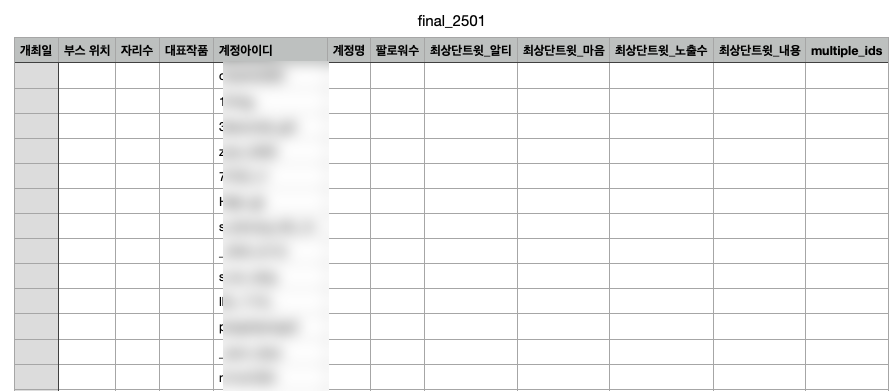
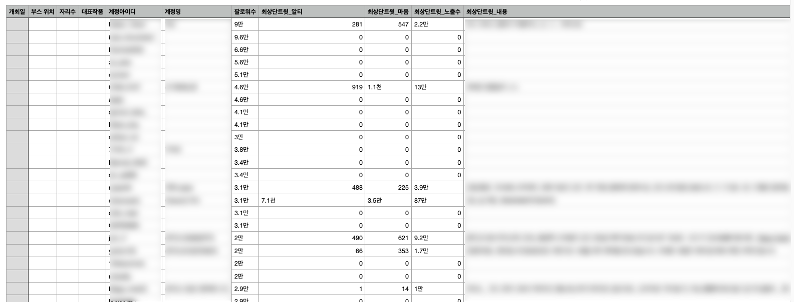
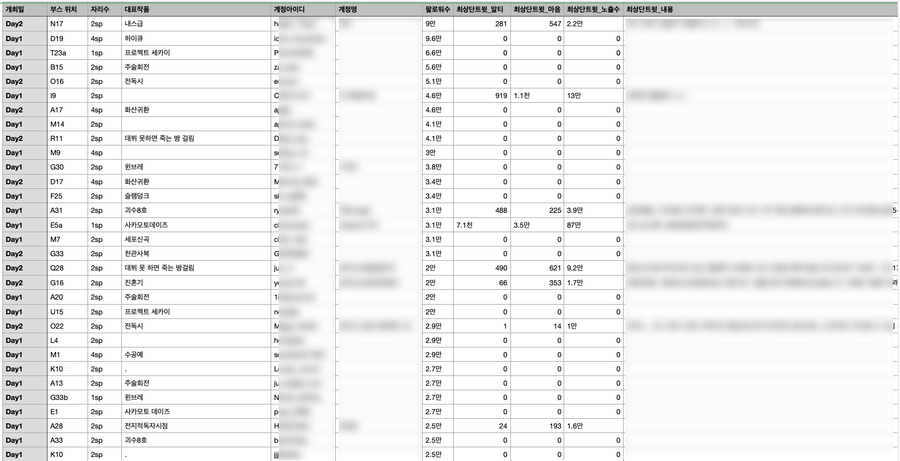

# 동인네트워크 부스 정보 수집 프로그램

이 프로젝트는 동인네트워크의 행사 부스 정보를 수집한 파일을 기반으로, Twitter 계정 정보를 Selenium으로 크롤링하고 계정 정보와 부스 정보를 한 눈에 정리하는 프로젝트입니다.

## 실행 순서

1. `Preprocess.ipynb`
   - 동인네트워크 API를 통해 행사 부스 정보를 수집
   - 수집된 데이터를 전처리하여 CSV 파일로 저장
   - 위치 정보를 파싱하여 열, 번호, 반부스 정보로 분리

   

2. `selenium_run.py`
   - 수집된 부스 정보에서 Twitter 계정 정보를 추출
   - Selenium을 사용하여 각 Twitter 계정의 상세 정보 수집
   - 수집된 데이터를 CSV 파일로 저장

   

3. `User_Booth_match.ipynb`
   - 수집된 부스 정보와 Twitter 계정 정보를 매칭
   - 데이터 분석 및 시각화 수행
   - 최종 결과물 생성

   

## 요구 사항

- Python 3.x
- Selenium
- pandas
- jupyter notebook

## 설치

필요한 라이브러리를 설치하려면 다음 명령어를 사용하세요:

```sh
pip install selenium pandas jupyter
```

## 파일 설명

### Preprocess.ipynb
- 동인네트워크 API를 통한 부스 정보 수집
- 위치 정보 파싱 (열, 번호, 반부스)
- 데이터 전처리 및 CSV 파일 생성

### selenium_run.py
이 스크립트는 Selenium을 사용하여 Twitter 계정 정보를 수집하고, 수집된 데이터를 CSV 파일로 저장하는 프로그램입니다.

#### 주요 기능
- `sleep_random_sec(min, max)`: 주어진 범위 내에서 랜덤한 시간 동안 대기
- `get_twitter_user_data(driver, input_ID)`: 주어진 Twitter 사용자 ID에 대한 데이터 수집
  - 계정 이름
  - 팔로워 수
  - 최상단 트윗 내용
  - 최상단 트윗의 리트윗 수
  - 최상단 트윗의 마음 수
  - 최상단 트윗의 노출 수

### User_Booth_match.ipynb
- 부스 정보와 Twitter 계정 정보 매칭
- 데이터 분석 및 시각화
- 최종 결과물 생성

## 주의 사항

- Twitter 계정이 비공개이거나 존재하지 않는 경우, 해당 계정의 정보를 수집할 수 없습니다.
- selenium_run.py 실행 중 크롬 브라우저가 자동으로 열리고 닫힙니다.
- API 요청 제한을 고려하여 적절한 대기 시간을 설정해야 합니다.

## 문의

궁금한 사항이 있으면 @Juicy_Wave로 문의하세요.

